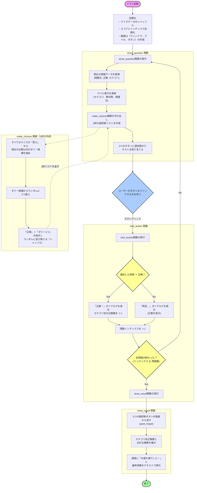

# 3択クイズアプリの処理フロー

本ファイルは、3択クイズアプリ（`index.html` 内のJavaScriptおよび元となった `quiz_tkinter.py`）の動作ロジックをまとめたフローチャートです。

## フローチャート (Mermaid)

```mermaid
graph TD
    Start([アプリ起動]) --> Init["初期化<br>・クイズデータのシャッフル<br>・スコアとインデックス初期化<br>・画面UI（ウィンドウ、ラベル、ボタン）の作成"]
    Init --> ShowQ[show_question関数の実行]
    
    %% --- show_question関数の内部処理 ---
    subgraph SQ [show_question 関数]
        ShowQ --> GetQ["現在の問題データを取得<br>(問題文, 正解, カテゴリ)"]
        GetQ --> UpLbl["ラベル表示を更新<br>(カテゴリ、第何問、問題文)"]
        UpLbl --> GenChoice["make_choices関数を呼び出し<br>3択の選択肢リストを作成"]
        GenChoice --> UpBtn["3つのボタンに選択肢のテキストを割り当てる"]
    end
    
    UpBtn --> Wait{ユーザーがボタンをクリックするのを待つ}
    
    Wait -->|ボタンクリック| Click[click_button関数の実行]
    
    %% --- click_button関数の内部処理 ---
    subgraph CB [click_button 関数]
        Click --> Judge{"選択した回答 ＝ 正解？"}
        Judge -->|Yes| Correct["「正解！」ダイアログを表示<br>カテゴリ別の正解数を ＋1"]
        Judge -->|No| Incorrect["「残念…」ダイアログを表示<br>(正解を表示)"]
        Correct --> Next[問題インデックスを ＋1]
        Incorrect --> Next
        Next --> CheckEnd{"全問題が終わった？<br>(インデックス ≧ 問題数)"}
        CheckEnd -->|No| ShowQ
        CheckEnd -->|Yes| Result[show_result関数の実行]
    end
    
    %% --- show_result関数の内部処理 ---
    subgraph SR [show_result 関数]
        Result --> HideBtn["3つの選択肢ボタンを画面から消す<br>(pack_forget)"]
        HideBtn --> Agg["カテゴリ別正解数と<br>合計正解数を集計"]
        Agg --> DisplayRes["画面に「お疲れ様でした！」と<br>最終成績をテキストで表示"]
    end
    
    DisplayRes --> End([終了])
    
    %% --- make_choices関数の内部処理 ---
    subgraph MC [make_choices 関数（3択の作成）]
        GenChoice -.-> RunMC["すべてのクイズの「答え」から<br>現在の正解以外のダミー候補を抽出"]
        RunMC --> Sample["ダミー候補からランダムに2つ選ぶ"]
        Sample --> ShuffleChoice["「正解」＋「ダミー2つ」を結合し<br>ランダムに並び替える（シャッフル）"]
        ShuffleChoice -.->|3択リストを返す| GenChoice
    end

    %% スタイルの適用
    style Start fill:#f9f,stroke:#333,stroke-width:2px
    style End fill:#9f9,stroke:#333,stroke-width:2px
    style Judge fill:#ff9,stroke:#333,stroke-width:2px
    style CheckEnd fill:#ff9,stroke:#333,stroke-width:2px
    style Wait fill:#acf,stroke:#333,stroke-width:2px
```
