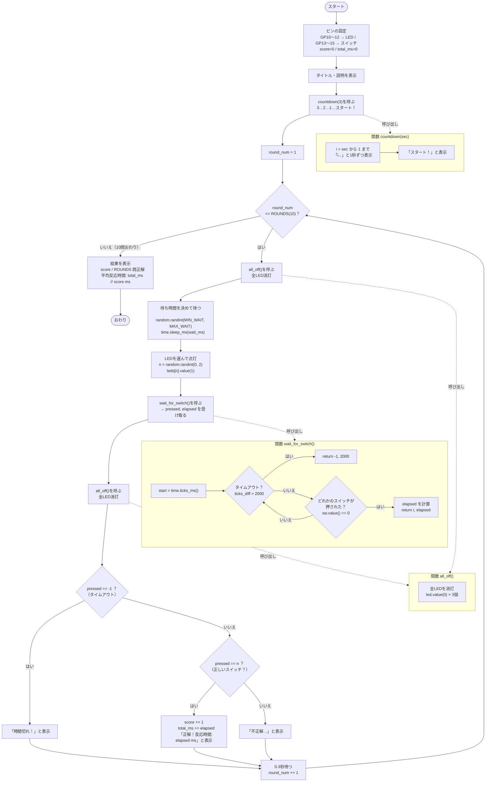

### C. ランダム点灯チャレンジ（スイッチ判定つき）

```mermaid
flowchart TD
    A([スタート]) --> B["ピンの設定
    GP10〜12 → LED / GP13〜15 → スイッチ
    score=0 / total_ms=0"]
    B --> C["タイトル・説明を表示"]
    C --> D["countdown(3)を呼ぶ
    3…2…1…スタート！"]
    D --> E["round_num = 1"]
    E --> F{"round_num
    <= ROUNDS(10)？"}
    F -- "いいえ（10問おわり）" --> S
    F -- "はい" --> G["all_off()を呼ぶ
    全LED消灯"]
    G --> H["待ち時間を決めて待つ
    random.randint(MIN_WAIT, MAX_WAIT)
    time.sleep_ms(wait_ms)"]
    H --> I["LEDを選んで点灯
    n = random.randint(0, 2)
    leds[n].value(1)"]
    I --> J["wait_for_switch()を呼ぶ
    → pressed, elapsed を受け取る"]
    J --> K["all_off()を呼ぶ
    全LED消灯"]
    K --> L{"pressed == -1 ？
    （タイムアウト）"}
    L -- "はい" --> M["「時間切れ！」と表示"]
    L -- "いいえ" --> N{"pressed == n ？
    （正しいスイッチ？）"}
    N -- "はい" --> O["score += 1
    total_ms += elapsed
    「正解！反応時間: elapsed ms」と表示"]
    N -- "いいえ" --> P["「不正解…」と表示"]
    M & O & P --> Q["0.3秒待つ
    round_num += 1"]
    Q --> F
    S["結果を表示
    score / ROUNDS 問正解
    平均反応時間: total_ms // score ms"] --> T([おわり])

    subgraph all_off["関数 all_off()"]
        U["全LEDを消灯
        led.value(0) × 3個"]
    end

    subgraph wait_for_switch_func["関数 wait_for_switch()"]
        V["start = time.ticks_ms()"] --> W{"タイムアウト？
        ticks_diff > 2000"}
        W -- "はい" --> X["return -1, 2000"]
        W -- "いいえ" --> Y{"どれかのスイッチが
        押された？
        sw.value() == 0"}
        Y -- "いいえ" --> W
        Y -- "はい" --> Z["elapsed を計算
        return i, elapsed"]
    end

    subgraph countdown_func["関数 countdown(sec)"]
        CA["i = sec から 1 まで
        「i...」と1秒ずつ表示"] --> CB["「スタート！」と表示"]
    end

    D -. 呼び出し .-> countdown_func
    G -. 呼び出し .-> all_off
    J -. 呼び出し .-> wait_for_switch_func
    K -. 呼び出し .-> all_off
```
