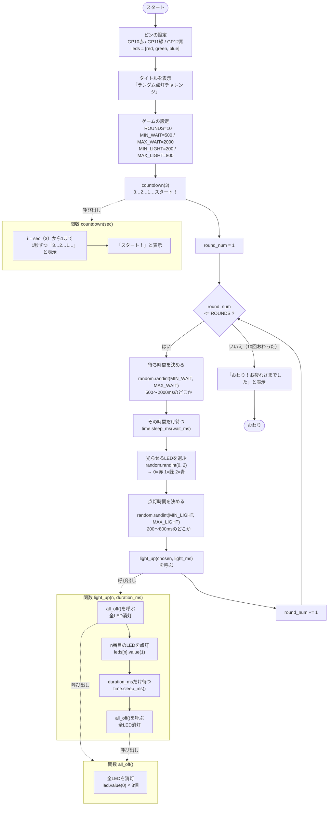

```mermaid
flowchart TD
    A([スタート]) --> B["ピンの設定
    GP10赤 / GP11緑 / GP12青
    leds = [red, green, blue]"]
    B --> C["タイトルを表示
    「ランダム点灯チャレンジ」"]
    C --> D["ゲームの設定
    ROUNDS=10
    MIN_WAIT=500 / MAX_WAIT=2000
    MIN_LIGHT=200 / MAX_LIGHT=800"]
    D --> E["countdown(3)
    3…2…1…スタート！"]

    E --> F["round_num = 1"]
    F --> G{"round_num
    <= ROUNDS ?"}
    G -- "いいえ（10回おわった）" --> N

    G -- "はい" --> H["待ち時間を決める
    random.randint(MIN_WAIT, MAX_WAIT)
    500〜2000msのどこか"]
    H --> I["その時間だけ待つ
    time.sleep_ms(wait_ms)"]
    I --> J["光らせるLEDを選ぶ
    random.randint(0, 2)
    → 0=赤 1=緑 2=青"]
    J --> K["点灯時間を決める
    random.randint(MIN_LIGHT, MAX_LIGHT)
    200〜800msのどこか"]
    K --> L["light_up(chosen, light_ms)を呼ぶ"]
    L --> M["round_num += 1"]
    M --> G

    N["「おわり！お疲れさまでした」と表示"] --> O([おわり])

    subgraph all_off["関数 all_off()"]
        P["全LEDを消灯
        led.value(0) × 3個"]
    end

    subgraph light_up_func["関数 light_up(n, duration_ms)"]
        Q["all_off()を呼ぶ
        全LED消灯"] --> R["n番目のLEDを点灯
        leds[n].value(1)"]
        R --> S["duration_msだけ待つ
        time.sleep_ms()"]
        S --> T["all_off()を呼ぶ
        全LED消灯"]
    end

    subgraph countdown_func["関数 countdown(sec)"]
        U["i = sec（3）から1まで
        1秒ずつ「3…2…1…」と表示"] --> V["「スタート！」と表示"]
    end

    L -. 呼び出し .-> light_up_func
    E -. 呼び出し .-> countdown_func
    Q -. 呼び出し .-> all_off
    T -. 呼び出し .-> all_off
```
