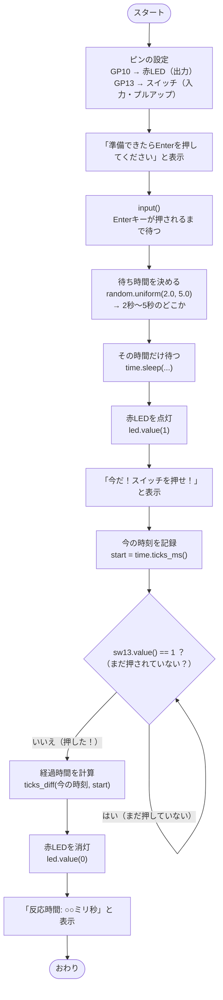

```mermaid
flowchart TD
    A([スタート]) --> B["ピンの設定
    GP10 → 赤LED（出力）
    GP13 → スイッチ（入力・プルアップ）"]
    B --> C["「準備できたらEnterを押してください」と表示"]
    C --> D["input()
    Enterキーが押されるまで待つ"]
    D --> E["待ち時間を決める
    random.uniform(2.0, 5.0)
    → 2秒〜5秒のどこか"]
    E --> F["その時間だけ待つ
    time.sleep(...)"]
    F --> G["赤LEDを点灯
    led.value(1)"]
    G --> H["「今だ！スイッチを押せ！」と表示"]
    H --> I["今の時刻を記録
    start = time.ticks_ms()"]
    I --> J{"sw13.value() == 1 ？
    （まだ押されていない？）"}
    J -- "はい（まだ押していない）" --> J
    J -- "いいえ（押した！）" --> K["経過時間を計算
    ticks_diff(今の時刻, start)"]
    K --> L["赤LEDを消灯
    led.value(0)"]
    L --> M["「反応時間: ○○ミリ秒」と表示"]
    M --> N([おわり])
```