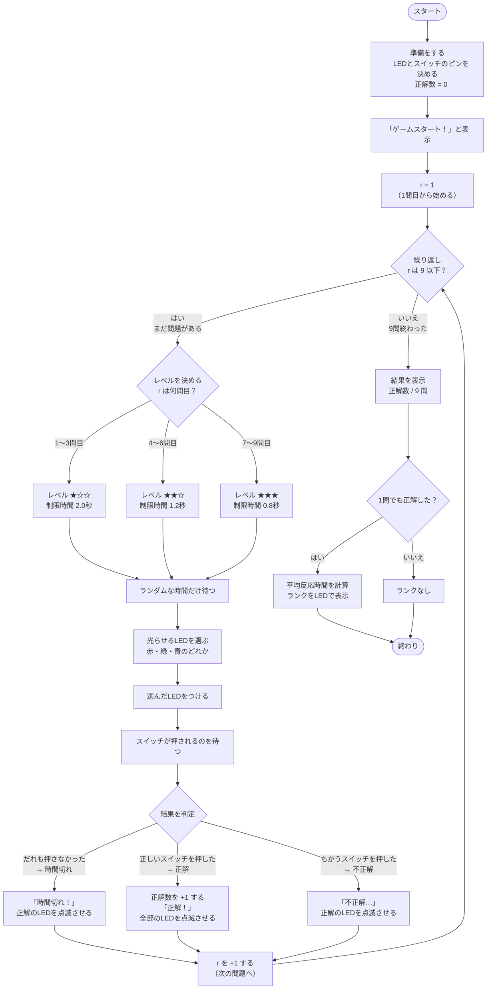

## 反射神経ゲーム 全体の流れ

```mermaid
flowchart TD
    A([スタート]) --> B["準備をする
    LEDとスイッチのピンを決める
    正解数 = 0"]
    B --> C["「ゲームスタート！」と表示"]

    C --> D["r = 1
    （1問目から始める）"]

    D --> E{"繰り返し
    r は 9 以下？"}

    E -->|"はい
    まだ問題がある"| F{"レベルを決める
    r は何問目？"}

    F -->|"1〜3問目"| G1["レベル ★☆☆
    制限時間 2.0秒"]
    F -->|"4〜6問目"| G2["レベル ★★☆
    制限時間 1.2秒"]
    F -->|"7〜9問目"| G3["レベル ★★★
    制限時間 0.8秒"]

    G1 --> H
    G2 --> H
    G3 --> H

    H["ランダムな時間だけ待つ"] --> I["光らせるLEDを選ぶ
    赤・緑・青のどれか"]
    I --> J["選んだLEDをつける"]
    J --> K["スイッチが押されるのを待つ"]

    K --> L{"結果を判定"}

    L -->|"だれも押さなかった
    → 時間切れ"| M1["「時間切れ！」
    正解のLEDを点滅させる"]
    L -->|"正しいスイッチを押した
    → 正解"| M2["正解数を +1 する
    「正解！」
    全部のLEDを点滅させる"]
    L -->|"ちがうスイッチを押した
    → 不正解"| M3["「不正解…」
    正解のLEDを点滅させる"]

    M1 --> N
    M2 --> N
    M3 --> N

    N["r を +1 する
    （次の問題へ）"] --> E

    E -->|"いいえ
    9問終わった"| O["結果を表示
    正解数 / 9 問"]

    O --> P{"1問でも正解した？"}
    P -->|"はい"| Q["平均反応時間を計算
    ランクをLEDで表示"]
    P -->|"いいえ"| R["ランクなし"]

    Q --> S([終わり])
    R --> S
```
