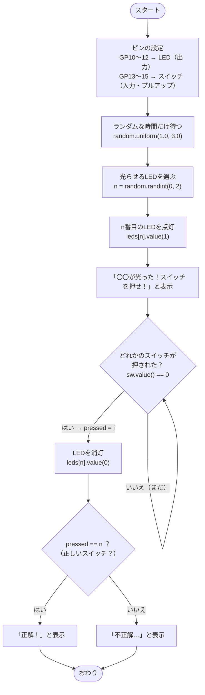

### A. 押したスイッチを当てろ！（1問だけ）

```mermaid
flowchart TD
    A([スタート]) --> B["ピンの設定
    GP10〜12 → LED（出力）
    GP13〜15 → スイッチ（入力・プルアップ）"]
    B --> C["ランダムな時間だけ待つ
    random.uniform(1.0, 3.0)"]
    C --> D["光らせるLEDを選ぶ
    n = random.randint(0, 2)"]
    D --> E["n番目のLEDを点灯
    leds[n].value(1)"]
    E --> F["「〇〇が光った！スイッチを押せ！」と表示"]
    F --> G{"どれかのスイッチが
    押された？
    sw.value() == 0"}
    G -- "いいえ（まだ）" --> G
    G -- "はい → pressed = i" --> H["LEDを消灯
    leds[n].value(0)"]
    H --> I{"pressed == n ？
    （正しいスイッチ？）"}
    I -- "はい" --> J["「正解！」と表示"]
    I -- "いいえ" --> K["「不正解…」と表示"]
    J & K --> L([おわり])
```
