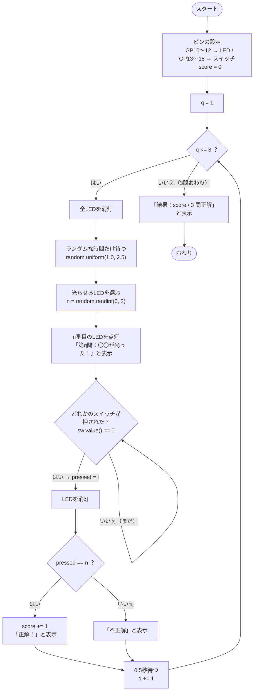

### B. 3問連続チャレンジ

```mermaid
flowchart TD
    A([スタート]) --> B["ピンの設定
    GP10〜12 → LED / GP13〜15 → スイッチ
    score = 0"]
    B --> C["q = 1"]
    C --> D{"q <= 3 ？"}
    D -- "いいえ（3問おわり）" --> M
    D -- "はい" --> E["全LEDを消灯"]
    E --> F["ランダムな時間だけ待つ
    random.uniform(1.0, 2.5)"]
    F --> G["光らせるLEDを選ぶ
    n = random.randint(0, 2)"]
    G --> H["n番目のLEDを点灯
    「第q問：〇〇が光った！」と表示"]
    H --> I{"どれかのスイッチが
    押された？
    sw.value() == 0"}
    I -- "いいえ（まだ）" --> I
    I -- "はい → pressed = i" --> J["LEDを消灯"]
    J --> K{"pressed == n ？"}
    K -- "はい" --> L["score += 1
    「正解！」と表示"]
    K -- "いいえ" --> N["「不正解」と表示"]
    L & N --> O["0.5秒待つ
    q += 1"]
    O --> D
    M["「結果：score / 3 問正解」と表示"] --> P([おわり])
```
